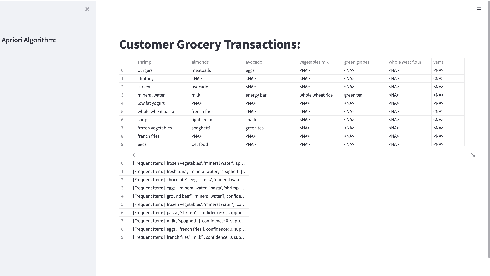

# Apriori Algorithm - To Decide What Customers like

Purpose of this demo application is to showcase how Apriori Algorithm works and And how using Data mining retail companies decide which Items to scrap and which item to keep based on the 
knowledge and associated rules based on customer purchasing pattern.

### Steps to build python based docker image

* Checkout codebase
```
git clone https://github.com/RitreshGirdhar/Apriori-Algorithm.git
cd apriori/
```

* Let's build object-detection docker image
```
docker build -t apriori
```

* Run application 
```
docker run -d -p8501:8501 apriori
```

### Let's test the application

* GoTo http://localhost:8501/

  OR Run directly
```
$ pip install streamlit
$ streamlit run apriori_main.py
```




## To run directly, use below command
``` 
python apriori.py
```